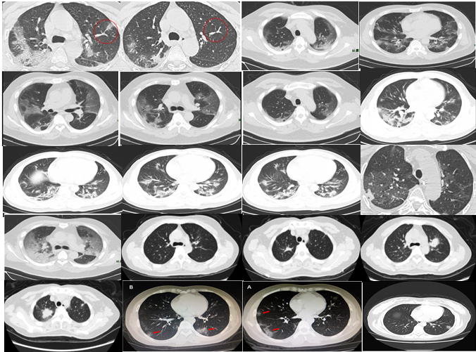
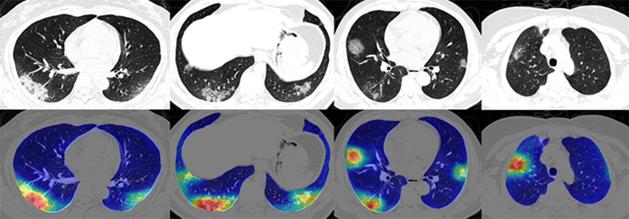

# Detection of Coronavirus Disease (COVID-19) based on Deep Features using CT-Scan Images

In the current situation of the rapid spread of COVID-19 many kinds of research have been going on. Deep learning is one of the recent techniques applicable in the field of medicine for diagnosis purposes. In this project, I aim to develop a system based on deep CNNs for the identification of COVID-19 as a classification task.

## Dataset
In an effort to spur the development of systems that can quickly spot signs of the novel coronavirus, a team of researchers at the University of San Diego this week released a data set containing The COVID-CT-Dataset, which has 349 CT images of transverse section of chest containing clinical findings of COVID-19 from 216 patients with confirmed cases of COVID-19. To demonstrate its potential, I will use this dataset to train an AI model.

## CNN Model
Artificial Intelligence involving medical imaging deep-learning systems has been developed in image feature extraction, including shape and spatial. Specifically, Convolutional Neural Network (CNN) has been proven in feature extraction and learning.There are a number of features for identifying viral pathogens on the basis of imaging patterns, which are associated with their specific pathogenesis. The hallmarks of COVID-19 are bilateral distribution of patchy shadows and ground glass opacity.

Therefore, developing an automated analysis system is necessary to save medical professionals valuable time. So a **deep learning algorithm using CT images to screen for CoronaVirus Disease (COVID-19)**  is proposed here. 

*The accuracy of the model will eventually increase if the number of dataset is increased
